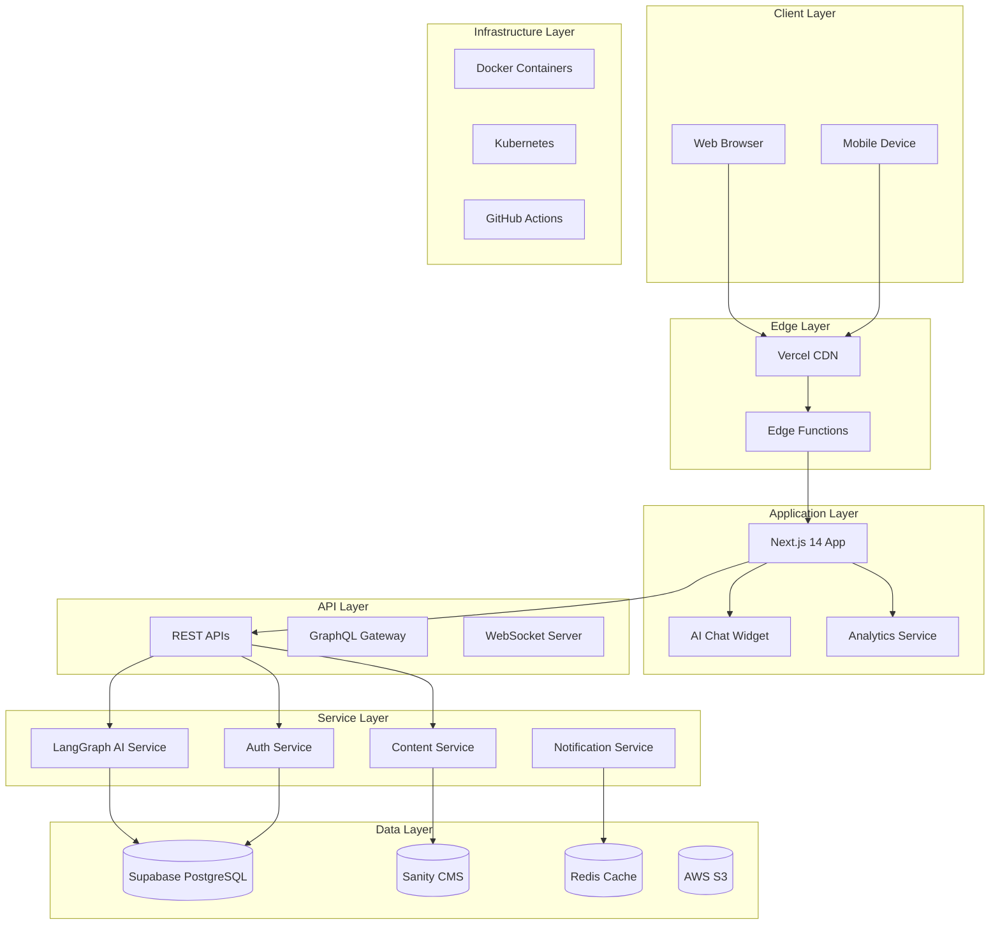
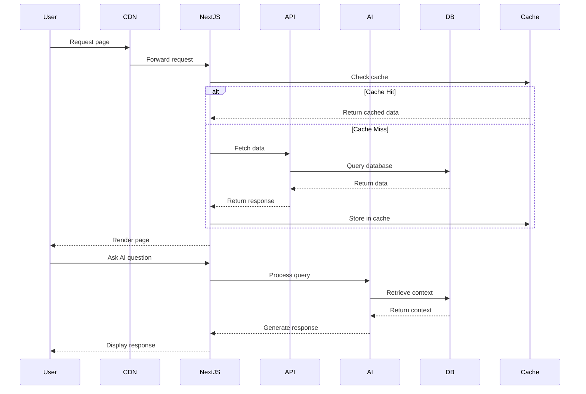
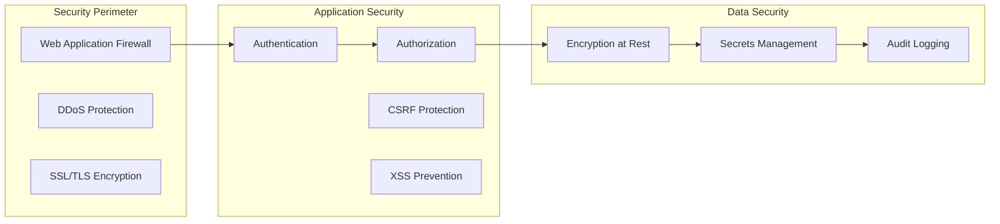
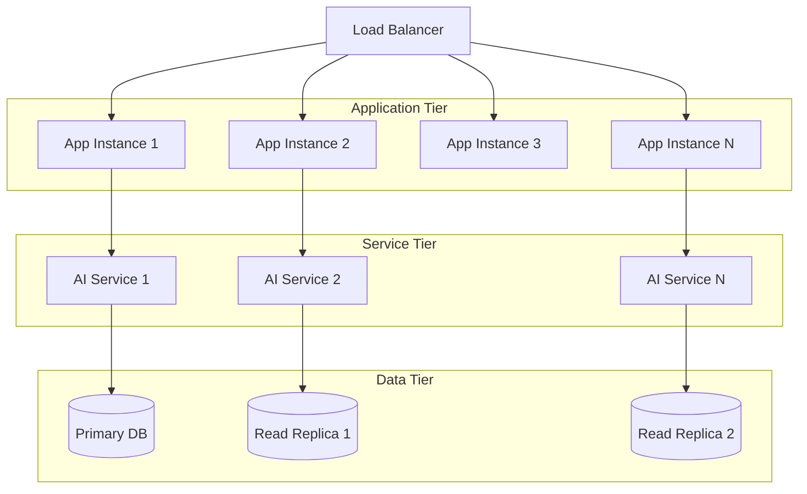

# Personal AI Platform - System Architecture Document

## Architecture Overview

The Personal AI Platform follows a modern, microservices-ready architecture with clear separation of concerns, leveraging best-in-class technologies for each layer of the stack.



## Component Architecture

### 1. Frontend Architecture (Next.js 14)

#### App Router Structure
```
app/
├── (marketing)/
│   ├── page.tsx                 # Landing page
│   ├── about/page.tsx           # About section
│   └── contact/page.tsx         # Contact form
├── (portfolio)/
│   ├── projects/
│   │   ├── page.tsx            # Projects listing
│   │   └── [slug]/page.tsx     # Project details
│   ├── publications/
│   │   ├── page.tsx            # Publications list
│   │   └── [id]/page.tsx       # Publication view
│   └── blog/
│       ├── page.tsx            # Blog listing
│       └── [slug]/page.tsx     # Blog post
├── (admin)/
│   ├── dashboard/page.tsx      # Admin dashboard
│   └── content/page.tsx        # Content management
├── api/                        # API routes
│   ├── ai/
│   │   └── chat/route.ts      # AI chat endpoint
│   ├── projects/route.ts       # Projects API
│   └── contact/route.ts        # Contact form API
└── layout.tsx                  # Root layout
```

#### Component Hierarchy
```typescript
// Core Components
<RootLayout>
  <Header>
    <Navigation />
    <ThemeToggle />
  </Header>
  <AIAssistant>
    <ChatInterface />
    <SuggestionPanel />
  </AIAssistant>
  <MainContent>
    <PageComponent />
  </MainContent>
  <Footer>
    <SocialLinks />
    <Copyright />
  </Footer>
</RootLayout>

// Feature Components
<ProjectShowcase>
  <FilterBar />
  <ProjectGrid>
    <ProjectCard />
  </ProjectGrid>
  <Pagination />
</ProjectShowcase>

<ResearchHub>
  <PublicationList />
  <ThesisViewer />
  <CitationGenerator />
</ResearchHub>
```

### 2. Backend Services Architecture

#### Service Definitions

**AI Service (Python/LangGraph)**
```python
class AIAssistantService:
    def __init__(self):
        self.llm = OpenAI(model="gpt-4")
        self.embeddings = OpenAIEmbeddings()
        self.vector_store = SupabaseVectorStore()
        self.conversation_memory = ConversationBufferMemory()
    
    async def process_query(self, query: str, context: dict) -> Response:
        # Retrieve relevant context
        relevant_docs = await self.vector_store.similarity_search(query)
        
        # Generate response with LangGraph
        response = await self.llm.generate(
            query=query,
            context=relevant_docs,
            conversation_history=self.conversation_memory
        )
        
        return Response(
            text=response.text,
            suggestions=response.suggestions,
            related_content=response.related_content
        )
```

**Content Service (Node.js/TypeScript)**
```typescript
class ContentService {
  private sanityClient: SanityClient;
  private cache: RedisCache;
  
  async getProjects(filters?: ProjectFilters): Promise<Project[]> {
    const cacheKey = `projects:${JSON.stringify(filters)}`;
    
    // Check cache first
    const cached = await this.cache.get(cacheKey);
    if (cached) return cached;
    
    // Fetch from Sanity
    const query = buildProjectQuery(filters);
    const projects = await this.sanityClient.fetch(query);
    
    // Cache results
    await this.cache.set(cacheKey, projects, 3600);
    
    return projects;
  }
  
  async getProjectBySlug(slug: string): Promise<Project> {
    return this.sanityClient.fetch(
      `*[_type == "project" && slug.current == $slug][0]`,
      { slug }
    );
  }
}
```

### 3. Data Flow Architecture

#### Request Flow Diagram


### 4. Infrastructure Architecture

#### Deployment Architecture
```yaml
# Kubernetes Deployment Configuration
apiVersion: apps/v1
kind: Deployment
metadata:
  name: personal-ai-platform
spec:
  replicas: 3
  selector:
    matchLabels:
      app: personal-ai
  template:
    metadata:
      labels:
        app: personal-ai
    spec:
      containers:
      - name: nextjs-app
        image: navya-ai/frontend:latest
        ports:
        - containerPort: 3000
        env:
        - name: SUPABASE_URL
          valueFrom:
            secretKeyRef:
              name: api-secrets
              key: supabase-url
      - name: ai-service
        image: navya-ai/ai-service:latest
        ports:
        - containerPort: 8000
        resources:
          requests:
            memory: "2Gi"
            cpu: "1"
          limits:
            memory: "4Gi"
            cpu: "2"
```

#### CI/CD Pipeline
```yaml
# GitHub Actions Workflow
name: Deploy Personal AI Platform

on:
  push:
    branches: [main]
  pull_request:
    branches: [main]

jobs:
  test:
    runs-on: ubuntu-latest
    steps:
      - uses: actions/checkout@v3
      - name: Setup Node.js
        uses: actions/setup-node@v3
        with:
          node-version: '20'
      - run: npm ci
      - run: npm test
      - run: npm run lint
      - run: npm run type-check
  
  build:
    needs: test
    runs-on: ubuntu-latest
    steps:
      - uses: actions/checkout@v3
      - name: Build Docker images
        run: |
          docker build -t navya-ai/frontend:${{ github.sha }} .
          docker build -t navya-ai/ai-service:${{ github.sha }} ./ai-service
      - name: Push to registry
        run: |
          docker push navya-ai/frontend:${{ github.sha }}
          docker push navya-ai/ai-service:${{ github.sha }}
  
  deploy:
    needs: build
    runs-on: ubuntu-latest
    if: github.ref == 'refs/heads/main'
    steps:
      - name: Deploy to Kubernetes
        run: |
          kubectl set image deployment/personal-ai-platform \
            nextjs-app=navya-ai/frontend:${{ github.sha }} \
            ai-service=navya-ai/ai-service:${{ github.sha }}
```

### 5. Security Architecture

#### Security Layers


#### Security Implementation
```typescript
// Security Middleware Stack
export const securityMiddleware = [
  helmet(), // Security headers
  cors({
    origin: process.env.ALLOWED_ORIGINS?.split(','),
    credentials: true
  }),
  rateLimit({
    windowMs: 15 * 60 * 1000, // 15 minutes
    max: 100 // limit each IP to 100 requests per windowMs
  }),
  csrf({ cookie: true }), // CSRF protection
  sanitize(), // Input sanitization
  authenticate(), // JWT verification
  authorize() // Role-based access control
];
```

### 6. Monitoring & Observability

#### Monitoring Stack
```yaml
monitoring:
  metrics:
    - prometheus:
        scrape_interval: 30s
        targets:
          - application_metrics
          - infrastructure_metrics
          - business_metrics
    
  logging:
    - elasticsearch:
        indices:
          - application-logs
          - audit-logs
          - error-logs
    
  tracing:
    - jaeger:
        sampling_rate: 0.1
        services:
          - frontend
          - api
          - ai-service
  
  alerting:
    - pagerduty:
        severity_levels:
          - critical: immediate
          - high: 15_minutes
          - medium: 1_hour
          - low: next_business_day
```

#### Health Checks
```typescript
// Health Check Endpoints
app.get('/health', (req, res) => {
  res.json({
    status: 'healthy',
    version: process.env.APP_VERSION,
    uptime: process.uptime(),
    timestamp: new Date().toISOString()
  });
});

app.get('/health/deep', async (req, res) => {
  const checks = await Promise.all([
    checkDatabase(),
    checkRedis(),
    checkAIService(),
    checkSanity()
  ]);
  
  res.json({
    status: checks.every(c => c.healthy) ? 'healthy' : 'degraded',
    services: checks
  });
});
```

### 7. Performance Architecture

#### Caching Strategy
```typescript
// Multi-layer Caching
class CacheStrategy {
  layers = [
    {
      name: 'Browser Cache',
      ttl: 3600,
      scope: 'static_assets'
    },
    {
      name: 'CDN Cache',
      ttl: 900,
      scope: 'pages'
    },
    {
      name: 'Redis Cache',
      ttl: 300,
      scope: 'api_responses'
    },
    {
      name: 'Application Cache',
      ttl: 60,
      scope: 'computed_values'
    }
  ];
  
  async get(key: string): Promise<any> {
    // Check each cache layer
    for (const layer of this.layers) {
      const value = await layer.get(key);
      if (value) return value;
    }
    return null;
  }
}
```

#### Performance Optimizations
```typescript
// Next.js Performance Config
module.exports = {
  images: {
    domains: ['cdn.sanity.io'],
    formats: ['image/avif', 'image/webp'],
    deviceSizes: [640, 750, 828, 1080, 1200, 1920],
    imageSizes: [16, 32, 48, 64, 96, 128, 256, 384]
  },
  
  experimental: {
    optimizeCss: true,
    scrollRestoration: true
  },
  
  webpack: (config) => {
    config.optimization.splitChunks = {
      chunks: 'all',
      cacheGroups: {
        default: false,
        vendors: false,
        framework: {
          name: 'framework',
          chunks: 'all',
          test: /(?<!node_modules.*)[\\/]node_modules[\\/](react|react-dom)[\\/]/,
          priority: 40
        },
        lib: {
          test(module) {
            return module.size() > 160000;
          },
          name(module) {
            const hash = crypto.createHash('sha1');
            hash.update(module.identifier());
            return hash.digest('hex').substring(0, 8);
          },
          priority: 30,
          minChunks: 1,
          reuseExistingChunk: true
        }
      }
    };
    return config;
  }
};
```

### 8. Scalability Architecture

#### Horizontal Scaling Strategy


---
*Architecture Version: 1.0*
*Last Updated: 2025-08-09*
*Review Cycle: Monthly*