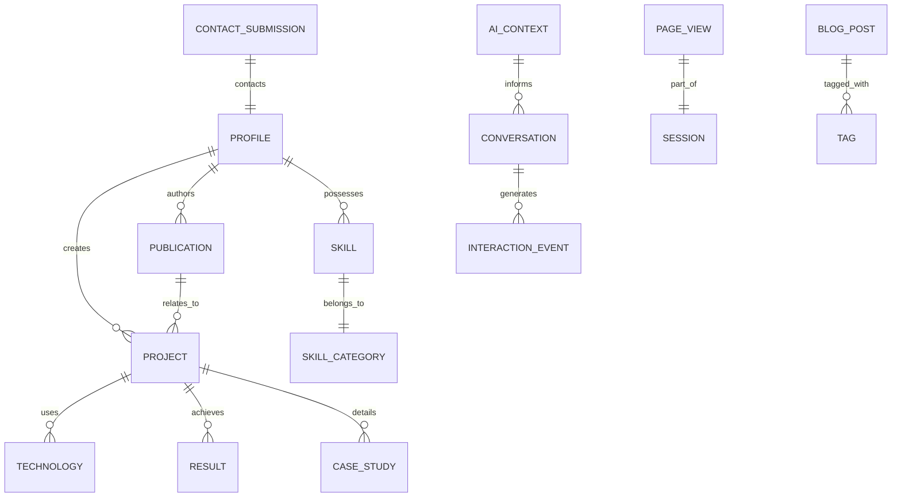
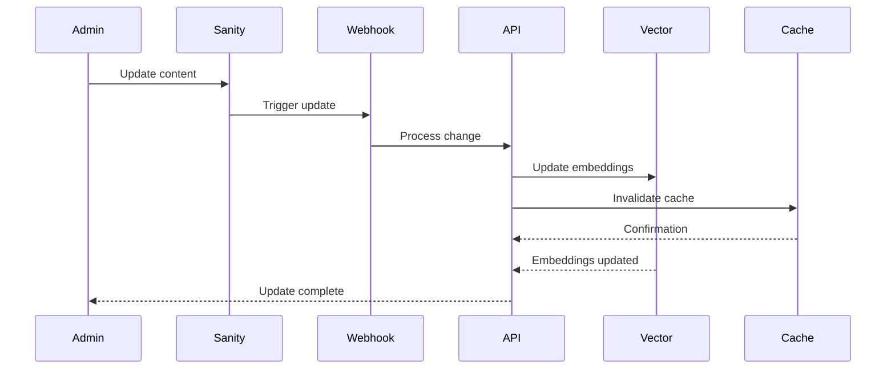

# Personal AI Platform - Data Architecture Document

## Data Model Overview

The data architecture follows a hybrid approach combining structured (PostgreSQL), document-based (Sanity CMS), and vector (embeddings) storage to optimize for different use cases.

## Core Data Models

### 1. Professional Profile Schema

#### User Profile (Supabase)
```sql
CREATE TABLE profiles (
  id UUID PRIMARY KEY DEFAULT uuid_generate_v4(),
  email TEXT UNIQUE NOT NULL,
  full_name TEXT NOT NULL,
  title TEXT NOT NULL,
  bio TEXT,
  location TEXT,
  linkedin_url TEXT,
  github_url TEXT,
  resume_pdf_url TEXT,
  profile_image_url TEXT,
  created_at TIMESTAMP WITH TIME ZONE DEFAULT NOW(),
  updated_at TIMESTAMP WITH TIME ZONE DEFAULT NOW()
);

CREATE TABLE professional_summary (
  id UUID PRIMARY KEY DEFAULT uuid_generate_v4(),
  profile_id UUID REFERENCES profiles(id),
  years_experience INTEGER,
  specializations TEXT[],
  industries TEXT[],
  clearance_level TEXT,
  availability_status TEXT,
  preferred_roles TEXT[],
  salary_range JSONB,
  updated_at TIMESTAMP WITH TIME ZONE DEFAULT NOW()
);
```

### 2. Project Portfolio Schema

#### Sanity CMS Schema
```javascript
// schemas/project.js
export default {
  name: 'project',
  title: 'Project',
  type: 'document',
  fields: [
    {
      name: 'title',
      title: 'Project Title',
      type: 'string',
      validation: Rule => Rule.required()
    },
    {
      name: 'slug',
      title: 'Slug',
      type: 'slug',
      options: {
        source: 'title',
        maxLength: 96
      },
      validation: Rule => Rule.required()
    },
    {
      name: 'company',
      title: 'Company',
      type: 'reference',
      to: [{ type: 'company' }]
    },
    {
      name: 'role',
      title: 'My Role',
      type: 'string',
      validation: Rule => Rule.required()
    },
    {
      name: 'duration',
      title: 'Duration',
      type: 'object',
      fields: [
        {
          name: 'startDate',
          title: 'Start Date',
          type: 'date'
        },
        {
          name: 'endDate',
          title: 'End Date',
          type: 'date'
        },
        {
          name: 'ongoing',
          title: 'Ongoing',
          type: 'boolean'
        }
      ]
    },
    {
      name: 'summary',
      title: 'Executive Summary',
      type: 'text',
      rows: 3,
      validation: Rule => Rule.required().max(500)
    },
    {
      name: 'description',
      title: 'Detailed Description',
      type: 'blockContent'
    },
    {
      name: 'problemStatement',
      title: 'Problem Statement',
      type: 'text'
    },
    {
      name: 'solution',
      title: 'Solution Approach',
      type: 'blockContent'
    },
    {
      name: 'results',
      title: 'Results & Impact',
      type: 'array',
      of: [
        {
          type: 'object',
          fields: [
            {
              name: 'metric',
              title: 'Metric',
              type: 'string'
            },
            {
              name: 'value',
              title: 'Value',
              type: 'string'
            },
            {
              name: 'impact',
              title: 'Business Impact',
              type: 'text'
            }
          ]
        }
      ]
    },
    {
      name: 'technologies',
      title: 'Technologies Used',
      type: 'array',
      of: [
        {
          type: 'reference',
          to: [{ type: 'technology' }]
        }
      ]
    },
    {
      name: 'skills',
      title: 'Skills Demonstrated',
      type: 'array',
      of: [{ type: 'string' }],
      options: {
        layout: 'tags'
      }
    },
    {
      name: 'architecture',
      title: 'Architecture Diagram',
      type: 'image',
      options: {
        hotspot: true
      }
    },
    {
      name: 'caseStudy',
      title: 'Detailed Case Study',
      type: 'document',
      fields: [
        {
          name: 'background',
          type: 'blockContent'
        },
        {
          name: 'challenges',
          type: 'blockContent'
        },
        {
          name: 'approach',
          type: 'blockContent'
        },
        {
          name: 'implementation',
          type: 'blockContent'
        },
        {
          name: 'outcomes',
          type: 'blockContent'
        },
        {
          name: 'lessonsLearned',
          type: 'blockContent'
        }
      ]
    },
    {
      name: 'links',
      title: 'Project Links',
      type: 'object',
      fields: [
        {
          name: 'demo',
          title: 'Demo URL',
          type: 'url'
        },
        {
          name: 'github',
          title: 'GitHub Repository',
          type: 'url'
        },
        {
          name: 'documentation',
          title: 'Documentation',
          type: 'url'
        }
      ]
    },
    {
      name: 'featured',
      title: 'Featured Project',
      type: 'boolean',
      description: 'Show this project on the homepage'
    },
    {
      name: 'order',
      title: 'Display Order',
      type: 'number'
    }
  ]
};
```

### 3. Skills & Technologies Schema

#### PostgreSQL Schema
```sql
CREATE TABLE technologies (
  id UUID PRIMARY KEY DEFAULT uuid_generate_v4(),
  name TEXT UNIQUE NOT NULL,
  category TEXT NOT NULL, -- 'language', 'framework', 'tool', 'platform'
  proficiency_level INTEGER CHECK (proficiency_level BETWEEN 1 AND 5),
  years_experience DECIMAL(3,1),
  last_used DATE,
  certifications TEXT[],
  icon_url TEXT,
  created_at TIMESTAMP WITH TIME ZONE DEFAULT NOW()
);

CREATE TABLE skill_categories (
  id UUID PRIMARY KEY DEFAULT uuid_generate_v4(),
  name TEXT UNIQUE NOT NULL,
  display_order INTEGER,
  description TEXT
);

CREATE TABLE skills (
  id UUID PRIMARY KEY DEFAULT uuid_generate_v4(),
  category_id UUID REFERENCES skill_categories(id),
  name TEXT NOT NULL,
  proficiency INTEGER CHECK (proficiency BETWEEN 1 AND 10),
  years_experience DECIMAL(3,1),
  projects_count INTEGER DEFAULT 0,
  endorsements INTEGER DEFAULT 0,
  keywords TEXT[],
  created_at TIMESTAMP WITH TIME ZONE DEFAULT NOW()
);

-- Junction table for project-technology relationships
CREATE TABLE project_technologies (
  project_id UUID NOT NULL,
  technology_id UUID REFERENCES technologies(id),
  usage_type TEXT, -- 'primary', 'secondary', 'explored'
  PRIMARY KEY (project_id, technology_id)
);
```

### 4. Publications & Research Schema

#### Sanity CMS Schema
```javascript
// schemas/publication.js
export default {
  name: 'publication',
  title: 'Publication',
  type: 'document',
  fields: [
    {
      name: 'title',
      title: 'Title',
      type: 'string',
      validation: Rule => Rule.required()
    },
    {
      name: 'type',
      title: 'Publication Type',
      type: 'string',
      options: {
        list: [
          { title: 'Journal Article', value: 'journal' },
          { title: 'Conference Paper', value: 'conference' },
          { title: 'Thesis', value: 'thesis' },
          { title: 'Technical Report', value: 'report' },
          { title: 'Blog Post', value: 'blog' },
          { title: 'White Paper', value: 'whitepaper' }
        ]
      }
    },
    {
      name: 'authors',
      title: 'Authors',
      type: 'array',
      of: [{ type: 'string' }]
    },
    {
      name: 'venue',
      title: 'Publication Venue',
      type: 'string'
    },
    {
      name: 'date',
      title: 'Publication Date',
      type: 'date'
    },
    {
      name: 'abstract',
      title: 'Abstract',
      type: 'text'
    },
    {
      name: 'keywords',
      title: 'Keywords',
      type: 'array',
      of: [{ type: 'string' }]
    },
    {
      name: 'doi',
      title: 'DOI',
      type: 'string'
    },
    {
      name: 'pdfFile',
      title: 'PDF File',
      type: 'file',
      options: {
        accept: '.pdf'
      }
    },
    {
      name: 'citations',
      title: 'Citation Count',
      type: 'number'
    },
    {
      name: 'relatedProjects',
      title: 'Related Projects',
      type: 'array',
      of: [
        {
          type: 'reference',
          to: [{ type: 'project' }]
        }
      ]
    }
  ]
};
```

### 5. AI Assistant Context Schema

#### Vector Database Schema (Supabase pgvector)
```sql
CREATE EXTENSION IF NOT EXISTS vector;

CREATE TABLE ai_context_documents (
  id UUID PRIMARY KEY DEFAULT uuid_generate_v4(),
  document_type TEXT NOT NULL, -- 'resume', 'project', 'publication', 'skill'
  document_id UUID,
  content TEXT NOT NULL,
  metadata JSONB,
  embedding vector(1536), -- OpenAI embeddings dimension
  created_at TIMESTAMP WITH TIME ZONE DEFAULT NOW(),
  updated_at TIMESTAMP WITH TIME ZONE DEFAULT NOW()
);

CREATE INDEX ON ai_context_documents USING ivfflat (embedding vector_cosine_ops)
  WITH (lists = 100);

CREATE TABLE conversation_history (
  id UUID PRIMARY KEY DEFAULT uuid_generate_v4(),
  session_id TEXT NOT NULL,
  user_message TEXT,
  assistant_response TEXT,
  context_used JSONB,
  feedback_score INTEGER,
  created_at TIMESTAMP WITH TIME ZONE DEFAULT NOW()
);

CREATE TABLE ai_training_queue (
  id UUID PRIMARY KEY DEFAULT uuid_generate_v4(),
  document_type TEXT NOT NULL,
  document_id UUID,
  action TEXT NOT NULL, -- 'create', 'update', 'delete'
  processed BOOLEAN DEFAULT FALSE,
  processed_at TIMESTAMP WITH TIME ZONE,
  error_message TEXT,
  created_at TIMESTAMP WITH TIME ZONE DEFAULT NOW()
);
```

### 6. Contact & Interaction Schema

```sql
CREATE TABLE contact_submissions (
  id UUID PRIMARY KEY DEFAULT uuid_generate_v4(),
  name TEXT NOT NULL,
  email TEXT NOT NULL,
  company TEXT,
  inquiry_type TEXT NOT NULL,
  message TEXT NOT NULL,
  technologies_of_interest TEXT[],
  project_budget TEXT,
  timeline TEXT,
  urgency TEXT,
  ip_address INET,
  user_agent TEXT,
  referrer TEXT,
  spam_score DECIMAL(3,2),
  status TEXT DEFAULT 'new', -- 'new', 'read', 'responded', 'archived'
  responded_at TIMESTAMP WITH TIME ZONE,
  notes TEXT,
  created_at TIMESTAMP WITH TIME ZONE DEFAULT NOW()
);

CREATE TABLE newsletter_subscribers (
  id UUID PRIMARY KEY DEFAULT uuid_generate_v4(),
  email TEXT UNIQUE NOT NULL,
  name TEXT,
  interests TEXT[],
  frequency TEXT DEFAULT 'weekly',
  confirmed BOOLEAN DEFAULT FALSE,
  confirmation_token TEXT,
  unsubscribe_token TEXT,
  subscribed_at TIMESTAMP WITH TIME ZONE DEFAULT NOW(),
  unsubscribed_at TIMESTAMP WITH TIME ZONE
);
```

### 7. Analytics & Metrics Schema

```sql
CREATE TABLE page_views (
  id UUID PRIMARY KEY DEFAULT uuid_generate_v4(),
  session_id TEXT NOT NULL,
  page_path TEXT NOT NULL,
  page_title TEXT,
  referrer TEXT,
  user_agent TEXT,
  ip_address INET,
  country_code TEXT,
  device_type TEXT,
  browser TEXT,
  duration_seconds INTEGER,
  created_at TIMESTAMP WITH TIME ZONE DEFAULT NOW()
);

CREATE TABLE interaction_events (
  id UUID PRIMARY KEY DEFAULT uuid_generate_v4(),
  session_id TEXT NOT NULL,
  event_type TEXT NOT NULL, -- 'ai_chat', 'project_view', 'resume_download', etc.
  event_category TEXT,
  event_label TEXT,
  event_value JSONB,
  page_path TEXT,
  created_at TIMESTAMP WITH TIME ZONE DEFAULT NOW()
);

CREATE TABLE conversion_events (
  id UUID PRIMARY KEY DEFAULT uuid_generate_v4(),
  session_id TEXT NOT NULL,
  conversion_type TEXT NOT NULL, -- 'contact_form', 'resume_download', 'project_inquiry'
  conversion_value DECIMAL(10,2),
  source TEXT,
  medium TEXT,
  campaign TEXT,
  created_at TIMESTAMP WITH TIME ZONE DEFAULT NOW()
);

-- Materialized view for dashboard metrics
CREATE MATERIALIZED VIEW dashboard_metrics AS
SELECT
  DATE(created_at) as date,
  COUNT(DISTINCT session_id) as unique_visitors,
  COUNT(*) as total_page_views,
  AVG(duration_seconds) as avg_session_duration,
  COUNT(DISTINCT CASE WHEN event_type = 'ai_chat' THEN session_id END) as ai_interactions,
  COUNT(CASE WHEN event_type = 'resume_download' THEN 1 END) as resume_downloads,
  COUNT(CASE WHEN conversion_type = 'contact_form' THEN 1 END) as contact_submissions
FROM page_views pv
LEFT JOIN interaction_events ie USING (session_id)
LEFT JOIN conversion_events ce USING (session_id)
GROUP BY DATE(created_at);

CREATE UNIQUE INDEX ON dashboard_metrics (date);
```

### 8. Content Management Schema

#### Blog Posts (Sanity CMS)
```javascript
// schemas/blogPost.js
export default {
  name: 'blogPost',
  title: 'Blog Post',
  type: 'document',
  fields: [
    {
      name: 'title',
      title: 'Title',
      type: 'string',
      validation: Rule => Rule.required()
    },
    {
      name: 'slug',
      title: 'Slug',
      type: 'slug',
      options: {
        source: 'title'
      }
    },
    {
      name: 'category',
      title: 'Category',
      type: 'string',
      options: {
        list: [
          'Generative AI',
          'MLOps',
          'Ethics in AI',
          'Technical Tutorial',
          'Industry Insights',
          'Research',
          'Career'
        ]
      }
    },
    {
      name: 'excerpt',
      title: 'Excerpt',
      type: 'text',
      rows: 3
    },
    {
      name: 'content',
      title: 'Content',
      type: 'blockContent'
    },
    {
      name: 'featuredImage',
      title: 'Featured Image',
      type: 'image',
      options: {
        hotspot: true
      }
    },
    {
      name: 'tags',
      title: 'Tags',
      type: 'array',
      of: [{ type: 'string' }]
    },
    {
      name: 'publishedAt',
      title: 'Published At',
      type: 'datetime'
    },
    {
      name: 'readingTime',
      title: 'Reading Time (minutes)',
      type: 'number'
    },
    {
      name: 'codeSnippets',
      title: 'Code Snippets',
      type: 'array',
      of: [
        {
          type: 'object',
          fields: [
            {
              name: 'language',
              type: 'string'
            },
            {
              name: 'code',
              type: 'text'
            },
            {
              name: 'filename',
              type: 'string'
            }
          ]
        }
      ]
    }
  ]
};
```

## Data Relationships



## Data Flow Patterns

### 1. Content Update Flow


### 2. AI Context Training Flow
```python
async def train_ai_context(document_type: str, document_id: str):
    """
    Process document for AI context training
    """
    # 1. Fetch document
    document = await fetch_document(document_type, document_id)
    
    # 2. Prepare content
    content = prepare_content_for_embedding(document)
    
    # 3. Generate embeddings
    embeddings = await generate_embeddings(content)
    
    # 4. Store in vector database
    await store_embeddings(
        document_type=document_type,
        document_id=document_id,
        content=content,
        embeddings=embeddings,
        metadata=extract_metadata(document)
    )
    
    # 5. Update training queue
    await mark_as_processed(document_id)
    
    # 6. Invalidate relevant caches
    await invalidate_ai_cache(document_type)
```

## Data Governance

### Privacy & Compliance
```yaml
data_governance:
  privacy:
    - personal_data_minimization: true
    - consent_management: explicit
    - data_retention:
        contact_submissions: 2_years
        analytics: 1_year
        conversations: 90_days
    - right_to_deletion: implemented
    - data_portability: available
  
  security:
    - encryption_at_rest: AES-256
    - encryption_in_transit: TLS_1.3
    - access_control: RBAC
    - audit_logging: enabled
    - backup_strategy:
        frequency: daily
        retention: 30_days
        testing: monthly
  
  compliance:
    - gdpr: compliant
    - ccpa: compliant
    - accessibility: WCAG_2.1_AA
```

---
*Data Architecture Version: 1.0*
*Last Updated: 2025-08-09*
*Review Cycle: Monthly*